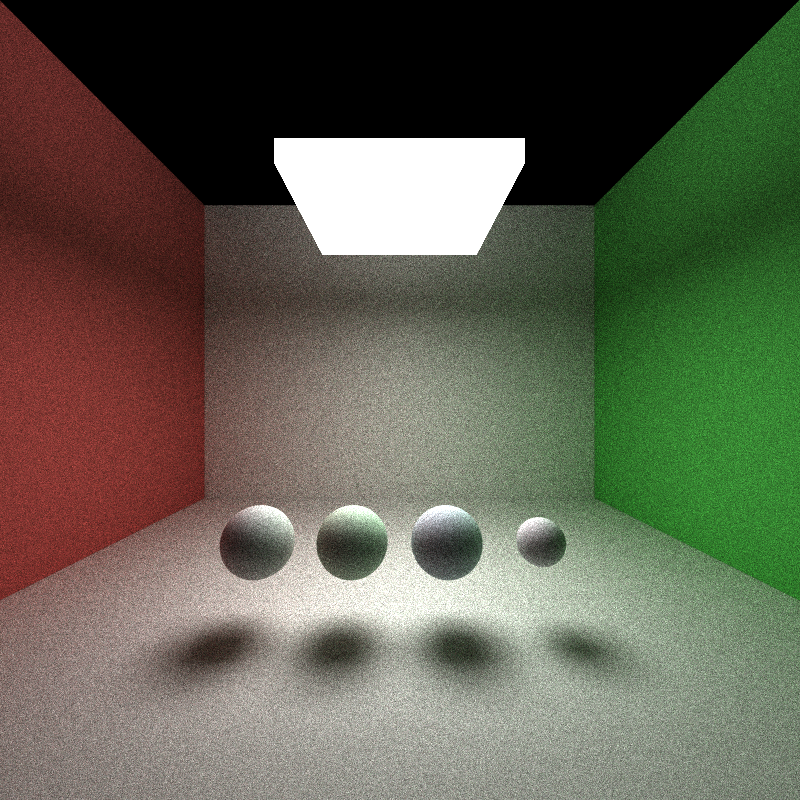
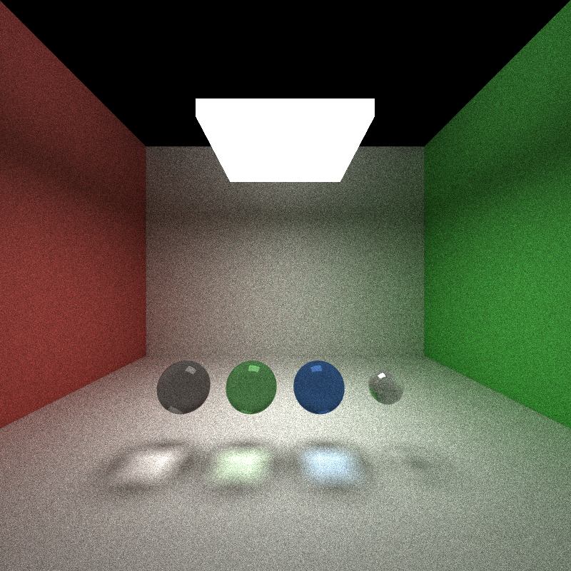
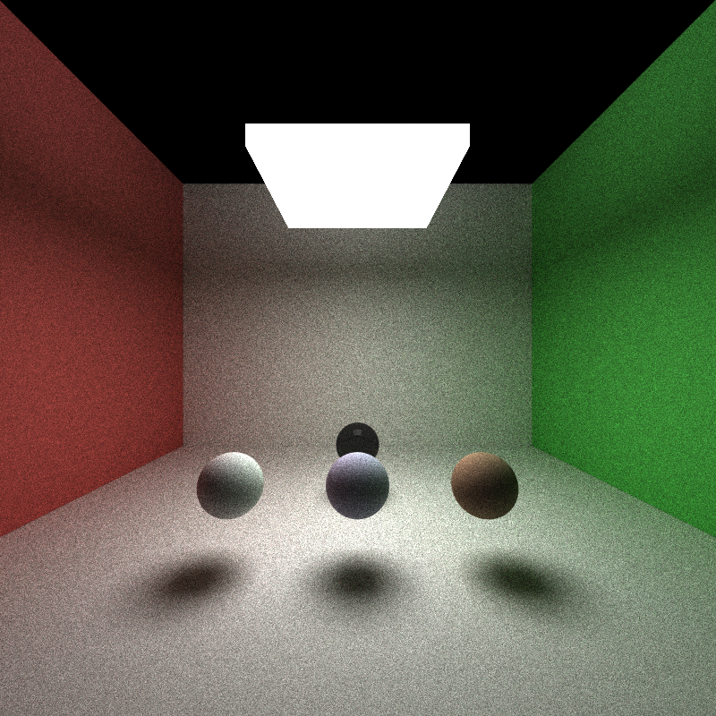
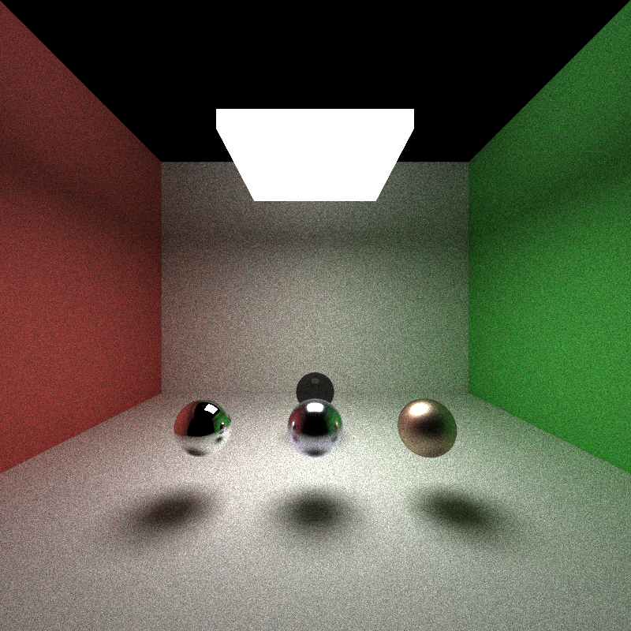
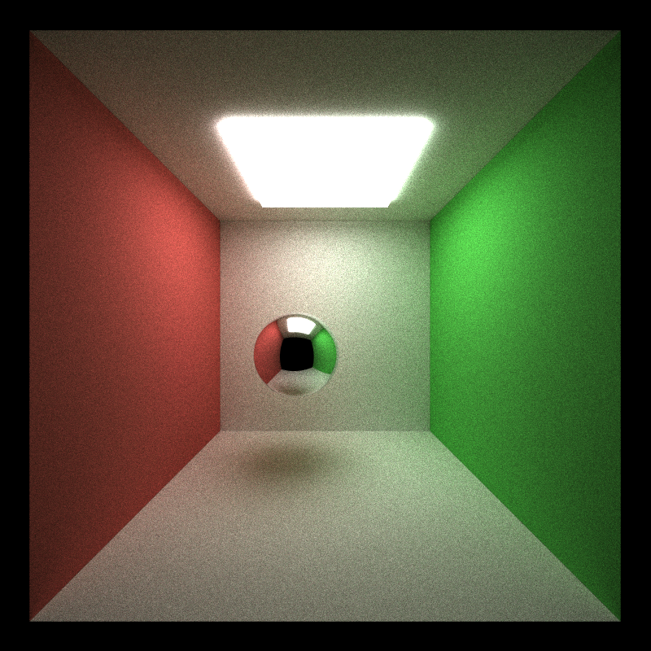
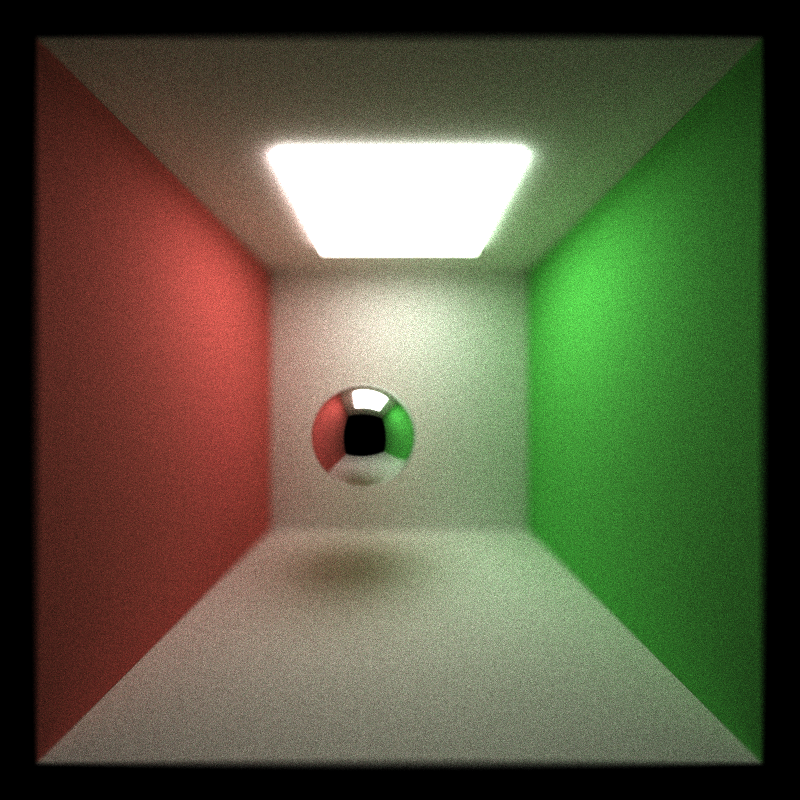
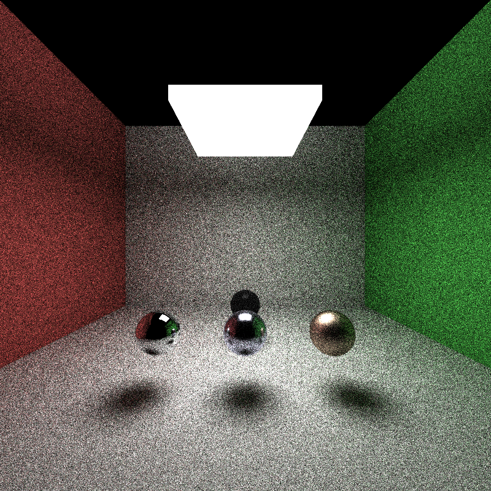
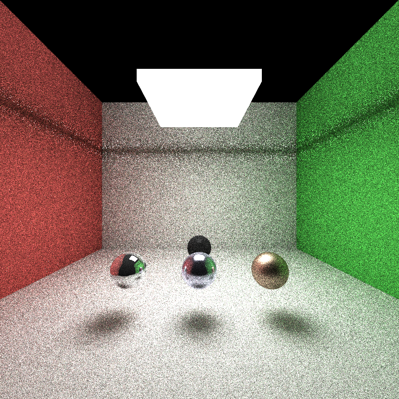
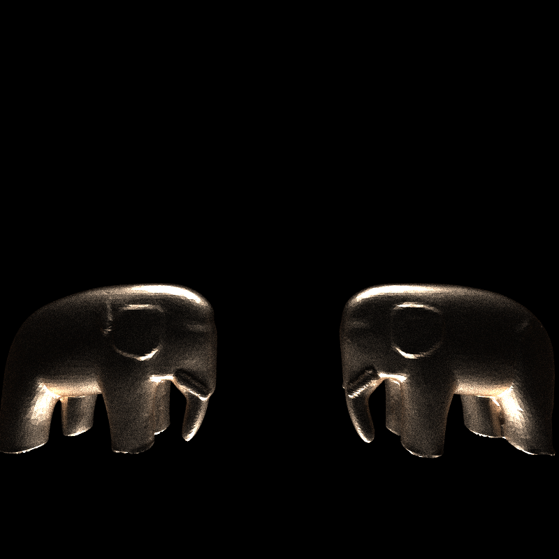

# CUDA Path Tracer

**University of Pennsylvania, CIS 565: GPU Programming and Architecture, Project 3**

- Yunhao Qian
  - [LinkedIn](https://www.linkedin.com/in/yunhao-qian-026980170/)
  - [GitHub](https://github.com/yunhao-qian)
- Tested on:
  - OS: Windows 11, 24H2
  - CPU: 13th Gen Intel(R) Core(TM) i7-13700 (2.10 GHz)
  - GPU: NVIDIA GeForce RTX 4090
  - RAM: 32.0 GB

## Overview

https://github.com/user-attachments/assets/15c436f7-9033-4ab4-8b65-7b9e0446731f

This project implements an interactive path tracer using CUDA. The program loads a scene file that describes the camera, geometry, materials, and lights, then renders the scene with path tracing to produce realistic lighting. This process is interactive: users can adjust the camera position, orientation, and zoom with the mouse. When the camera is fixed, the image is progressively refined by accumulating samples over time.

The general idea of path tracing is to simulate how light interacts with surfaces, but to do so by tracing paths **from the camera into the scene** (often called "backward" relative to the direction photons travel). Each path bounces around the scene until it reaches a light source, "escapes" from the scene, or is terminated. A pixel's color is estimated from the light that reaches the camera along these paths. Averaging more samples per pixel reduces noise. The sampling can be made more efficient with direct lighting (see below).

## Features

### Core Features

**Ideal diffuse surfaces.** A basic operation in path tracing is simulating how a ray bounces at a surface. This is handled in `scatterRay()` in `interactions.cu`. While the most general formulation uses a BSDF (Bidirectional Scattering Distribution Function), this project starts with an ideal diffuse (Lambertian) material, where outgoing directions are sampled with a cosine-weighted distribution over the hemisphere. The model is extended to support additional material types later on.

**Ray sorting.** With multiple material types, per-material logic can cause divergent control flow on the GPU, which hurts performance. To mitigate this, path segments are sorted by material type so that threads in the same warp are more likely to execute similar code. This is implemented in `pathtrace()` in `pathtrace.cu` using the Thrust library for sorting.

**Stochastic sampled anti-aliasing.** Always shooting a ray through the pixel center yields visible aliasing (jagged edges). A full solution (especially with textures) would track ray differentials, which is out of scope here. As a simpler approach, the primary ray is jittered within the pixel's region in `generateRayFromCamera()` in `pathtrace.cu`.

### Visual Improvements

#### Refraction

Implemented in `scatterRay()` (`interactions.cu`). Because the integrator is iterative on the GPU (as opposed to a recursive CPU approach), it's simpler to spawn only one outgoing ray at each event. Fresnel reflectance is approximated with Schlick's formula, and a weighted "coin flip" (a Bernoulli draw) decides whether the path reflects or refracts.

For transparent materials like tinted glass, light is attenuated as it passes through the medium. This attenuation is modeled using the Beer–Lambert law. Whether a ray is traveling inside the medium or in the surrounding air can be determined by comparing the ray's direction to the surface normal at the intersection point. A more robust implementation would explicitly track the medium type along with the ray state, but for this project's scope, that level of complexity is unnecessary.

Before (~35 ms / frame):



After (~36 ms / frame):



(This 1 ms difference is stable across multiple runs.)

Performance impact: In the current implementation, `scatterRay()` uses a large `if` structure that checks the material type and executes the corresponding logic. Introducing refraction adds another branch to this structure. However, since path segments are already sorted by material type, the additional control-flow divergence on the GPU is minimal. That said, refraction calculations are inherently more computationally expensive than those for other materials, so the overall performance impact is small but noticeable.

The implementation behaves the same on both CPU and GPU, except that the GPU version runs in parallel. Therefore, I do not expect any significant performance difference arising from this part. Further optimization is possible, such as streamlining the refraction computation (for example, by using GLM's built-in functions, which I neglected to do) and compacting the data structures used to store material properties.

#### Imperfect Specular Surfaces

By sampling outgoing directions from a cosine-power distribution around the perfect reflection direction, glossy highlights are produced. The concentration of the distribution is controlled by the material's `roughness` parameter.

Before (~35 ms / frame):



After (~35.5 ms / frame):



Its performance impact is similar to that of refraction: the additional branch in `scatterRay()` introduces only minimal divergence thanks to path sorting, and while the glossy reflection computation is somewhat more expensive, it does not significantly affect the overall performance. I suspect that the current scattering logic is not fully optimized, but it is unlikely to be the primary performance bottleneck of the path tracer.

#### Physically-based Depth-of-field

Implemented in `generateRayFromCamera()` (`pathtrace.cu`) using a thin-lens model. A point is sampled on the lens aperture, and the ray is aimed so that it passes through the chosen focus point on the focal plane. The aperture size is controlled by `lensRadius`, and the focus distance by `focalDistance`.

Before (~37 ms / frame):



After (~37 ms / frame):



Its performance impact is negligible. The implementation only adds a few instructions to jitter the sampled pixel position on the lens. When the lens radius is very large, it might slightly affect the distribution of ray paths, potentially influencing thread divergence, but this effect is too subtle to measure. There are no GPU-specific advantages to exploit here, and I do not expect this feature to need further optimization.

#### Direct Lighting

Letting paths find small lights via many bounces is inefficient and produces noisy images. At each bounce, the renderer can also sample a point on a light, checks whether the surface is illuminated (i.e., not in shadow), and, if illuminated, adds that contribution. This is implemented by `sampleDirectLighting()` in `interactions.cu`. In the current implementation, lights are sampled with weights related to their area and emittance, which helps but is not optimal. Multiple importance sampling would further reduce noise, but is out of scope here.

Before (~22.5 ms / frame):



After (23.5 ms / frame):



Note: I realized that in the previously submitted code, the line computing the weight of direct lighting samples is incorrect (line 573 in `interactions.cu`). I attempted a one-line correction, but there is no simple fix for the issue. When sampling uniformly on a flat light source, too few samples are taken near the light's edges, which causes visible artifacts—specifically, an abnormally dark stripe on the wall.

The performance impact is modest. Since this feature was tested on scenes with only a single light source, the additional computation for direct lighting remains small. The implementation should perform similarly on both CPU and GPU. The cost is expected to scale roughly linearly with the number of lights, as each light requires its own sampling and shadow-ray checks. This approach is not ideal for complex scenes with many lights. A more efficient strategy would be to precompute a probability distribution function (PDF) over all light sources and sample from it. After selecting a light, a point on its surface would then be sampled. Another possible optimization is to use a joint distribution over both light position and surface orientation, though this would require a more complex sampling scheme.

### Mesh Improvements

#### Mesh Loading

The custom JSON scene format was extended to support triangle meshes. Conversion from common 3D formats (OBJ, glTF, etc.) to this JSON is currently handled by external Python utilities (not included). The support is intentionally basic: only vertex positions and triangle indices are used. Each mesh is treated as a single geometry object with a uniform material.

A manually postprocessed json file is at [`ming_xiaoling_elephants.json`](scenes/ming_xiaoling_elephants.json). It was from a photo, converted to 3D model using Hunyuan3D-2.1, then simplified and cleaned up manually using a Python script, and finally converted to the custom JSON format, with additional lighting and camera settings added.


### Performance Improvements

#### Russian Roulette Path Termination

After many bounces, a path's expected contribution often becomes very small. To avoid wasting computation, Russian roulette is used to stochastically terminate paths. After a minimum bounce count, each path survives with probability proportional to its current throughput. If it survives, its weight is adjusted accordingly. This logic is applied during scattering in `scatterRay()` (`interactions.cu`).

This is a trivial but effective optimization, applying equally well on CPU and GPU. The performance gain is scene-dependent. In scenes with many bounces and low albedo surfaces, the savings can be significant. In scenes dominated by direct lighting or with few bounces, the impact is minimal.

#### Hierarchical Spatial Data Structures (BVH)

Ray–scene intersection is accelerated with a bounding volume hierarchy. A simple BVH (inspired by PBRT) is built recursively in `buildBVH()` (`scene.cpp`). When splitting a node, the longest axis of its bounding box is chosen and primitives are partitioned at the median along that axis. To support both analytic shapes and meshes, all mesh triangles are treated as individual primitives in the tree. Primitives are stored only in leaf nodes, while internal nodes store only bounding boxes and child indices. The BVH is built on the CPU and uploaded to the GPU for traversal.

GPU traversal in `traverseBVH()` (`pathtrace.cu`) is iterative and uses an explicit stack simulated by an array. For each node encountered: if the ray intersects the node's bounding box and the node is internal, its children are pushed onto the stack. If it's a leaf, the ray is tested against all primitives in that leaf and the closest hit is updated.



Without BVH, it takes around 1400 ms per frame and render does not finish in a reasonable time. With BVH, it takes around 35 ms per frame. Logs from the program give an idea of the mesh size:

```text
Loading 1 mesh(es)...
  Loaded mesh with 40000 triangles from 26216 vertices
Total triangles loaded: 40000
Built BVH with 28661 nodes for 40002 primitives (2 geoms + 40000 triangles)
Built BVH with 28661 nodes
```

The improvement is substantial. I didn't profile BVH construction, but for this scene it should be well under a second. On the GPU, the BVH pays off by dramatically reducing ray–primitive intersection tests. That said, explicit stack management on the GPU is less efficient than on the CPU, which can limit traversal speed. Also, NVIDIA GPUs (via OptiX, DirectX Raytracing, or Vulkan Ray Tracing) provide dedicated hardware for acceleration structures. Using those would likely deliver even better performance.

I've also observed that, under certain configurations, the current BVH splitter can degrade and produce highly unbalanced trees, which hurts performance. I need to harden the splitting heuristics and guard against these edge cases in the future.
